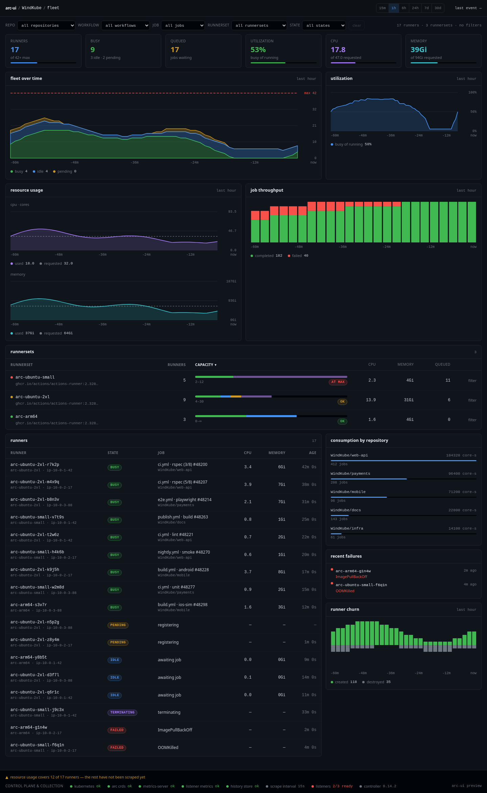
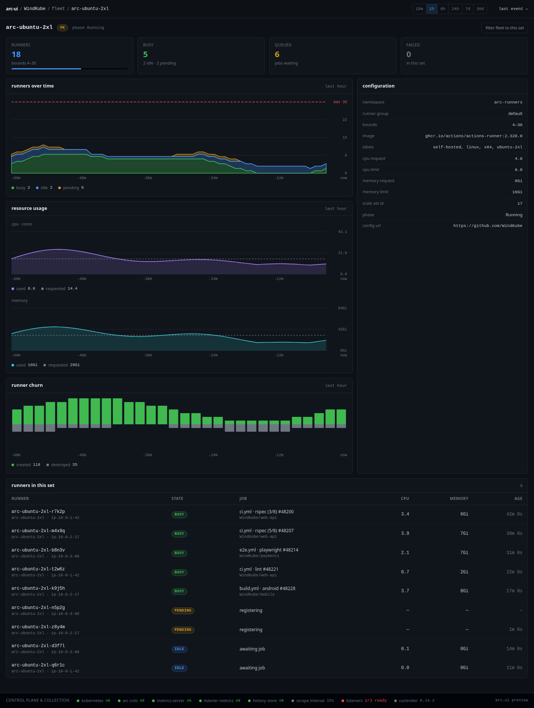
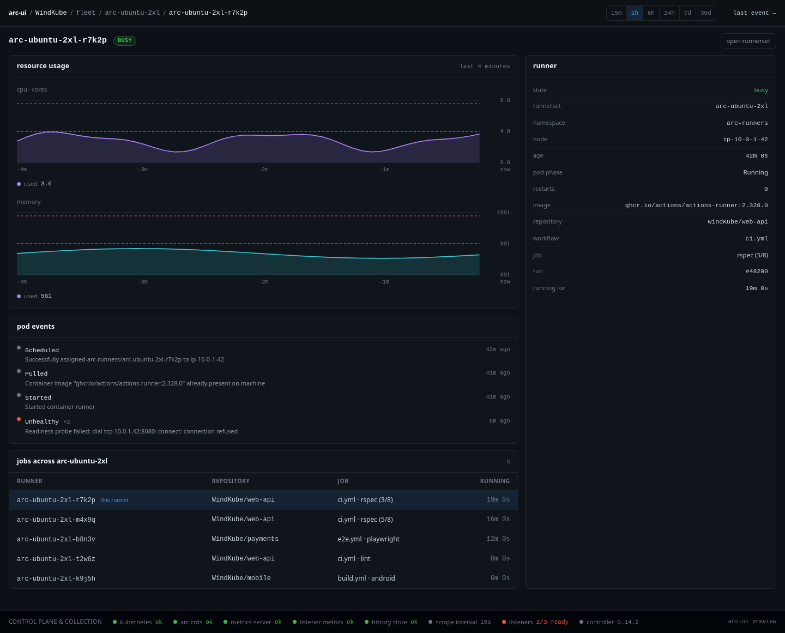

<div align="center">

# Actions Runner Controller UI

**A read-only dashboard for [GitHub Actions Runner Controller][arc] — what every
runner in the fleet is doing right now, what it cost, and what happened an hour
ago.**

[](https://github.com/WindKube/actions-runners-controller-ui/actions/workflows/ci.yml)
[](https://github.com/WindKube/actions-runners-controller-ui/releases/latest)
[](https://github.com/WindKube/actions-runners-controller-ui/pkgs/container/actions-runner-controller-ui)
[](go.mod)
[](#rbac)
[](LICENSE)

</div>



## Contents

- [Why](#why)
- [Screenshots](#screenshots)
- [Requirements](#requirements)
- [Quick start](#quick-start)
- [Configuration](#configuration)
- [Kubernetes](#kubernetes)
- [RBAC](#rbac)
- [Docker](#docker)
- [Development](#development)
- [How it is built](#how-it-is-built)
- [CI](#ci)
- [License](#license)

## Why

ARC tells you a scale set exists. It does not tell you that eleven jobs are
queued behind a set that has been pinned at its ceiling for twenty minutes, that
one runner is being OOMKilled on every attempt, or that the listener stopped
reporting an hour ago. This shows you that.

**It never writes to the cluster.** No scaling, no deletes, no annotations. The
shipped ClusterRole holds `get`, `list` and `watch` and nothing else — see
[RBAC](#rbac) for what is deliberately withheld and why.

**Every data source is optional.** The dashboard boots and serves with
metrics-server absent, with the ARC CRDs not installed, and with RBAC missing.
Each failure is reported as a named unavailable source in the footer, never as a
page of confident zeros — a dashboard that renders 0% CPU because it cannot read
metrics is worse than one that says so.

**It is readable before any script runs.** The page is rendered complete on the
server: deep links work, back and forward work, and the whole thing degrades to
plain HTML. [Datastar][datastar]'s only job is keeping it fresh over SSE.

## Screenshots

Three views, each answering a different question.

| View | Answers |
| --- | --- |
| **Fleet overview** | how many runners are busy / idle / pending / failed, per scale set, against each set's ceiling — and how much work is still queued |
| **RunnerSet detail** | one scale set over time: capacity, churn, job starts, the listener's queue |
| **Runner detail** | one ephemeral runner: phase history, CPU and memory against requests and limits, the events that explain a stuck pod |

The fleet overview is the screenshot at the top of this page.

<details>
<summary><b>RunnerSet detail</b> — one scale set over time</summary>



</details>

<details>
<summary><b>Runner detail</b> — one ephemeral runner, with pod events</summary>



</details>

These are generated from fixture data, not a live cluster, so they are
reproducible — see [Regenerating the screenshots](#regenerating-the-screenshots).

## Requirements

- A Kubernetes cluster running [Actions Runner Controller][arc] (the
  `actions.github.com` scale-set CRDs, not the legacy `actions.summerwind.net`
  ones).
- Read access to the runner namespaces and to the controller namespace.
- Optional: `metrics-server`, for CPU and memory. Optional: ARC's listener
  metrics, for queue depth ([how to turn them on](#queue-depth)). Both absent is
  a supported configuration.

## Quick start

```bash
helm install arc-ui ./chart \
  --namespace arc-systems --create-namespace \
  --set env.ARC_UI_NAMESPACES=arc-runners \
  --set env.ARC_UI_CONTROLLER_NAMESPACE=arc-systems

kubectl -n arc-systems port-forward svc/arc-ui 8080:8080
open http://localhost:8080
```

Or run the container straight against a `kubectl proxy` (see
[Docker](#docker) for why the proxy rather than a kubeconfig):

```bash
kubectl proxy --port=8001 &
docker run --rm --network host \
  -e KUBE_API_URL=http://127.0.0.1:8001 \
  -e ARC_UI_NAMESPACES=arc-runners \
  ghcr.io/windkube/actions-runner-controller-ui:latest serve
```

## Configuration

Everything comes from the environment. `internal/config/config.go` is the
authority; this table is it in prose.

| Variable | Default | What it does |
| --- | --- | --- |
| `ARC_UI_HTTP_ADDR` | `0.0.0.0:8080` | listen address |
| `ARC_UI_LOG_LEVEL` | `info` | `debug`, `info`, `warn`, `error` |
| `ARC_UI_LOG_FORMAT` | `json` | `json` or `console`; anything else refuses to start |
| `ARC_UI_NAMESPACES` | `arc-runners` | comma-separated namespaces holding the AutoscalingRunnerSets and runner pods. **Empty means every namespace** (needs cluster-wide RBAC) |
| `ARC_UI_CONTROLLER_NAMESPACE` | `arc-systems` | where the ARC controller and the AutoscalingListener pods live. Not the runner namespace |
| `ARC_UI_SCRAPE_INTERVAL` | `15s` | pod/node metrics poll period. Below 15s re-fetches identical data (metrics-server's own resolution) and only burns API quota; below 1s is rejected |
| `ARC_UI_LISTENER_METRICS_URL` | — | scrape **one** endpoint instead of discovering the listeners — for something that aggregates them, such as a Prometheus `/federate` URL. See [Queue depth](#queue-depth) |
| `ARC_UI_LISTENER_METRICS_PATH` | `/metrics` | the path discovered listeners serve metrics on; mirrors the controller chart's `metrics.listenerEndpoint` |
| `ARC_UI_DB_PATH` | `/data/arc-ui.db` | SQLite history file |
| `ARC_UI_RETENTION_RUNNER_RAW` | `15m` | raw per-runner samples — only the runner detail view reads them |
| `ARC_UI_RETENTION_SCOPE_RAW` | `6h` | raw per-scale-set samples |
| `ARC_UI_RETENTION_SCOPE_1M` | `168h` | 1-minute rollups (7 days) |
| `ARC_UI_RETENTION_SCOPE_5M` | `720h` | 5-minute rollups (30 days) |
| `ARC_UI_RETENTION_SCOPE_1H` | `9600h` | 1-hour rollups (~13 months) |
| `ARC_UI_GITHUB_ORG` | — | breadcrumb label. Empty derives it from the AutoscalingRunnerSet's `githubConfigUrl` |
| `ARC_UI_KUBECONFIG` | — | kubeconfig path. Unset means in-cluster if possible, else the default lookup |
| `ARC_UI_KUBE_CONTEXT` | — | context to select from that kubeconfig |
| `ARC_UI_KUBE_QPS` | `50` | client-go rate limit; must be > 0 |
| `ARC_UI_KUBE_BURST` | `100` | client-go burst; must be > 0 |
| `ARC_UI_SHUTDOWN_TIMEOUT` | `20s` | drain budget: in-flight requests, SSE streams, store close |
| `ARC_UI_PRESTOP_DELAY` | `8s` | keeps serving after readiness flips, so proxies stop routing first. At least twice the readiness period, or clients see 502s |
| `ARC_UI_SENTRY_DSN` | — | Sentry off when empty |
| `ARC_UI_SENTRY_ENVIRONMENT` | `production` | |
| `ARC_UI_SENTRY_SAMPLE_RATE` | `1.0` | |
| `KUBE_API_URL` | — | override the API server address. **Unprefixed on purpose**: it names shared infrastructure, not this app's own setting. `metrics.k8s.io` is an aggregated API served *through* the API server, so this one URL covers custom resources, pods, events and metrics alike |
| `METRICS_SERVER_URL` | — | deprecated alias for `KUBE_API_URL`, folded in with a warning. It was always a misunderstanding: nothing talks to metrics-server directly |

## Queue depth

Queue depth — jobs GitHub has assigned to a scale set that have no runner yet —
is the one number the cluster cannot tell you. It exists only on GitHub's side of
the listener's connection, so it comes from the ARC listeners' Prometheus
endpoints, and **ARC ships those disabled**. Everything else on the dashboard
works without them.

To turn them on, uncomment the `metrics:` block in the
`gha-runner-scale-set-controller` chart values:

```yaml
metrics:
  controllerManagerAddr: ":8080"
  listenerAddr: ":8080"
  listenerEndpoint: "/metrics"
```

then upgrade the controller and recreate the listener pods, which is what makes
them pick the flags up:

```bash
kubectl -n arc-systems delete pod \
  -l app.kubernetes.io/component=runner-scale-set-listener
```

Running jobs are unaffected; there is a few-second gap where new job assignments
are not picked up. Confirm the port exists — its absence is how a listener says
metrics are off:

```bash
kubectl -n arc-systems get pods \
  -l app.kubernetes.io/component=runner-scale-set-listener \
  -o jsonpath='{range .items[*]}{.metadata.name}{"\t"}{.spec.containers[0].ports}{"\n"}{end}'
```

Nothing else is needed: **the dashboard discovers the listeners itself**. It finds
the AutoscalingListener pods in `ARC_UI_CONTROLLER_NAMESPACE`, reads each pod's IP
and its port named `metrics`, and scrapes all of them, merging the answers per
scale set. That matters because ARC runs **one listener per scale set** and each
serves only its own series — so a fleet of twenty scale sets has twenty endpoints,
and no single URL covers it.

Which is also why `ARC_UI_LISTENER_METRICS_URL` is not the way to do this. It
scrapes exactly one endpoint, and:

- pointed at one listener, you get queue depth for that one scale set;
- pointed at a Service in front of all of them, you get **one** of them — a
  Service load-balances per connection and the scraper's keep-alive pins it to
  whichever pod answered first, then silently jumps to another when the
  connection is recycled.

Set it only when something genuinely aggregates the listeners while preserving
their `name` and `namespace` labels — a Prometheus federation endpoint, for
instance, in which case scrape the listeners with a PodMonitor using
`honorLabels: true` and point the dashboard at:

```
http://prometheus-operated.monitoring.svc:9090/federate?match%5B%5D=%7B__name__%3D~%22gha_.%2A%22%7D
```

Partial answers are published rather than discarded: if three of twenty listeners
are unreachable, the other seventeen sets keep their queue depth, the three show
no depth rather than zero, and the health strip names the listeners that failed.
A NetworkPolicy in the controller namespace, or a service mesh requiring mTLS, is
the usual reason for that.

## Kubernetes

```bash
helm install arc-ui ./chart \
  --namespace arc-systems --create-namespace \
  --set env.ARC_UI_NAMESPACES=arc-runners \
  --set env.ARC_UI_CONTROLLER_NAMESPACE=arc-systems
```

[`chart/README.md`](chart/README.md) is the long version. The short version of
what will surprise you:

- **One replica, enforced.** The chart calls `fail` on `replicaCount > 1`: the app
  owns one SQLite file on one ReadWriteOnce volume.
- **`strategy: Recreate`, not RollingUpdate.** A rolling update against an RWO
  volume deadlocks permanently — the new pod cannot attach while the old one
  holds the volume, and the old one is not removed until the new one is Ready.
- **The PVC survives `helm uninstall`** (`helm.sh/resource-policy: keep`), because
  the history cannot be re-derived from anywhere. Reinstalling under the same name
  then needs `helm install --take-ownership` (Helm 3.17+) or a manual adoption;
  the chart README has both.
- **`readOnlyRootFilesystem: true` plus an emptyDir at `/tmp`**, because SQLite
  needs somewhere for temporary files. Remove the mount and queries fail with
  `SQLITE_CANTOPEN`.
- **Liveness is on `/livez`, readiness on `/readyz`, and never the other way
  round.** Liveness pointed at readiness means an API server blip restarts the
  pod, throwing away warm informer caches and forcing a full re-LIST exactly when
  the API server is already struggling.

### RBAC

The ClusterRole is `get`/`list`/`watch` on:

| API group | Resources |
| --- | --- |
| `actions.github.com` | `autoscalingrunnersets`, `ephemeralrunnersets`, `ephemeralrunners`, `autoscalinglisteners` (+ each `/status`) |
| `""` (core) | `pods`, `events`, `nodes` |
| `apps` | `deployments` (to report the controller version) |
| `metrics.k8s.io` | `pods`, `nodes` |

Withheld on purpose: `secrets` (ARC keeps the GitHub App credentials there),
`pods/exec` and `pods/attach` (RCE inside a runner), `pods/log` (job logs contain
masked-but-recoverable values), and every write verb.

Two failure modes account for nearly every "the dashboard is broken" report:

1. **RBAC covers the runner namespace but not the controller namespace.** The
   AutoscalingListener pods live in the controller namespace and carry queue depth
   and listener health. The fleet renders perfectly; the listener panel is blank
   forever.
2. **The `metrics.k8s.io` resources are spelled `podmetrics`/`nodemetrics`.** They
   are named **`pods` and `nodes`** in that API group — the Go kinds are
   `PodMetrics`/`NodeMetrics`, which is where the wrong guess comes from. The
   apiserver accepts the wrong name silently, it matches nothing, and every scrape
   403s in a way that is indistinguishable from metrics-server being uninstalled.

   ```bash
   kubectl auth can-i list pods.metrics.k8s.io \
     --as=system:serviceaccount:arc-systems:arc-ui
   ```

## Docker

```bash
task docker:build     # docker build -t arc-ui:local .
task docker:up        # dashboard on :8080 + the kubectl proxy sidecar
task docker:down
```

The image is built with the **repository root** as its build context
(`docker build -t arc-ui:local .`), matching what `.github/workflows/ci.yml` and
`release-image.yml` pass (`context: .`, `file: Dockerfile`). Keeping the local
and CI invocations identical means a local build failure is a real build failure
rather than a context mismatch.

The runtime image is `gcr.io/distroless/static-debian12:nonroot`: no shell, no
package manager, no curl. The compose healthcheck therefore calls the binary's own
`arc-ui healthcheck` subcommand — a shell-form command or a curl-based
`HEALTHCHECK` cannot work.

`compose.yaml` documents the per-cluster recipes (kind, Docker Desktop, minikube,
a remote cluster with a static ServiceAccount token) in comments next to the
service they apply to.

### Talking to a cluster from a container

Against a real cluster the reliable path is a local `kubectl proxy`:

```bash
task run:proxy                                      # in one terminal
KUBE_API_URL=http://127.0.0.1:8001 ./arc-ui serve   # in another
open http://localhost:8080
```

Why the proxy rather than just handing the binary your kubeconfig: nearly every
real kubeconfig authenticates through an **exec credential plugin** — `aws eks
get-token`, `gke-gcloud-auth-plugin`, `kubelogin`. client-go resolves those by
executing a binary, and in a container that binary does not exist. `kubectl proxy`
runs on your host toolchain's terms, holds the credential, and re-exposes the API
as plain HTTP. Outside a container the kubeconfig path works fine too
(`ARC_UI_KUBECONFIG` / `ARC_UI_KUBE_CONTEXT`).

> [!WARNING]
> `kubectl proxy` is **completely unauthenticated** — anything that can reach its
> port acts as you, with all your permissions. Local machine only.

## Development

```bash
task install:tailwind         # one-time; templ comes from go.mod's tool directive
task gen                      # *_templ.go + internal/web/static/app.css
task build                    # produces ./arc-ui
task test
task check                    # vet + lint + tests
```

`task --list` has the rest.

### Regenerating the screenshots

The three views render from fixture data — a fleet under real load, with a
saturated set, an unbounded set, partial metrics coverage and a couple of failed
runners — so the output is reproducible and needs no cluster.

```bash
task preview        # docs/screenshots/*.html — self-contained, opens from disk
task preview:png    # docs/screenshots/*.png  — what this README embeds
```

The two are separate on purpose: rendering the HTML needs nothing but Go, while
rasterising it needs a browser, and `task preview` should keep working on a
machine that has no Chrome. `preview:png` drives headless Chrome over CDP from
[`tools/screenshot`](tools/screenshot) — its own Go module, so a browser
automation library never enters the application's dependency graph. It uses
`$ARC_UI_CHROME` if set, otherwise an installed Chrome/Chromium, otherwise it
downloads one into its own cache.

Animations and transitions are frozen before each capture, so re-running the task
against unchanged HTML produces byte-identical PNGs rather than a spurious binary
diff. Fonts come from the host, so screenshots regenerated on a different OS will
differ slightly.

## How it is built

- Go 1.26, cobra (CLI), zerolog (logs), caarlos0/env (config), sentry-go
- `k8s.io/client-go` informers over the ARC CRDs, pods, events and nodes;
  `k8s.io/metrics` for `metrics.k8s.io`
- Hand-vendored ARC CRD types in `internal/arcapi/v1alpha1` — ARC does not publish
  an importable Go API module
- gin (HTTP), [a-h/templ][templ] (server-rendered HTML), [Datastar][datastar] (SSE
  live updates)
- ent + `modernc.org/sqlite` (pure Go, so `CGO_ENABLED=0` still gives a static
  binary) for the sampled history
- Tailwind CSS v4 standalone, GitHub Primer dark palette (`assets/input.css`)
- Charts are server-computed SVG: the geometry is decided in Go, which is why the
  preview task exists at all

<details>
<summary><b>Repository layout</b></summary>

```text
cmd/arc-ui/          the CLI (serve, healthcheck, version)
internal/config/     env parsing and validation
internal/logging/    zerolog construction
internal/arcapi/     hand-vendored ARC CRD types, GVRs, label constants
internal/k8s/        informers, collectors, source health
internal/metrics/    metrics.k8s.io polling
internal/listener/   ARC listener Prometheus scrape
internal/fleet/      the domain model: Runner, RunnerSet, Snapshot, Source
internal/store/      ent + SQLite history, rollups and retention
internal/hub/        SSE fan-out
internal/web/        templ views, page assembly, Datastar wiring
internal/chart/      server-rendered SVG charts
chart/               the Helm chart
tools/screenshot/    HTML → PNG for the README (separate module)
assets/input.css     Tailwind v4 entry + the Primer dark palette tokens
docs/screenshots/    generated previews, HTML and PNG
```

</details>

## CI

| Workflow | Trigger | What it does |
|---|---|---|
| `ci.yml` | PR, push to `main` | golangci-lint, `go test -race` with a coverage floor, and a container build per architecture that smoke-tests the resulting image |
| `release-drafter.yml` | push to `main` | keeps a draft release up to date from merged PR titles |
| `release-image.yml` | release published, or manual dispatch with a tag | builds and pushes the multi-arch image to GHCR, signs it with cosign and attests its provenance |
| `zizmor.yml` | changes under `.github/`, weekly | audits the workflows themselves for supply-chain issues |

`release-image.yml` refuses any tag that is not `vMAJOR.MINOR.PATCH[-prerelease]`,
builds `linux/amd64` and `linux/arm64` on native runners, pushes them by digest
and joins them into a manifest list. A stable release is tagged `X.Y.Z`, `X.Y`
and `latest`; a prerelease gets only `X.Y.Z`. Nobody holds a signing key, so
there is nothing to leak and nothing to rotate:

```bash
gh attestation verify \
  oci://ghcr.io/windkube/actions-runner-controller-ui:<version> --owner WindKube
```

### Version stamping

The released semantic version reaches the binary through the build, not through
the source tree. `release-image.yml` validates the git tag against a semver
regex, strips the leading `v`, and passes the result as the `VERSION` build-arg.
The Dockerfile's build stage links it in:

```sh
go build -trimpath -ldflags="-s -w -X main.version=${VERSION}" ./cmd/arc-ui
```

`-X` can only overwrite a package-level **string variable**, which is why
`cmd/arc-ui/main.go` declares `var version = "dev"` rather than a constant — the
compiler would inline a constant and the linker would have nothing to patch.
From there the value is passed to `web.Builder.Version`, lands on every `Page`,
and is rendered by the footer health strip in `internal/web/layout.templ`.

Two things guard the chain, because every link in it fails silently — a broken
stamp still builds, still runs, and just quietly reports `dev`:

- `ci.yml` builds with `VERSION=0.0.0-pr` and asserts `arc-ui version` prints
  exactly that.
- `release-image.yml` runs `arc-ui version` against the **published** image and
  fails the release if it disagrees with the tag.

The commit SHA and build timestamp are deliberately *not* linked into the
binary. They ship as OCI labels (`org.opencontainers.image.revision` and
`.created`), which is where image metadata belongs and what
`docker buildx imagetools inspect` reads.

## License

[Apache 2.0](LICENSE).

[arc]: https://github.com/actions/actions-runner-controller
[datastar]: https://data-star.dev
[templ]: https://templ.guide
